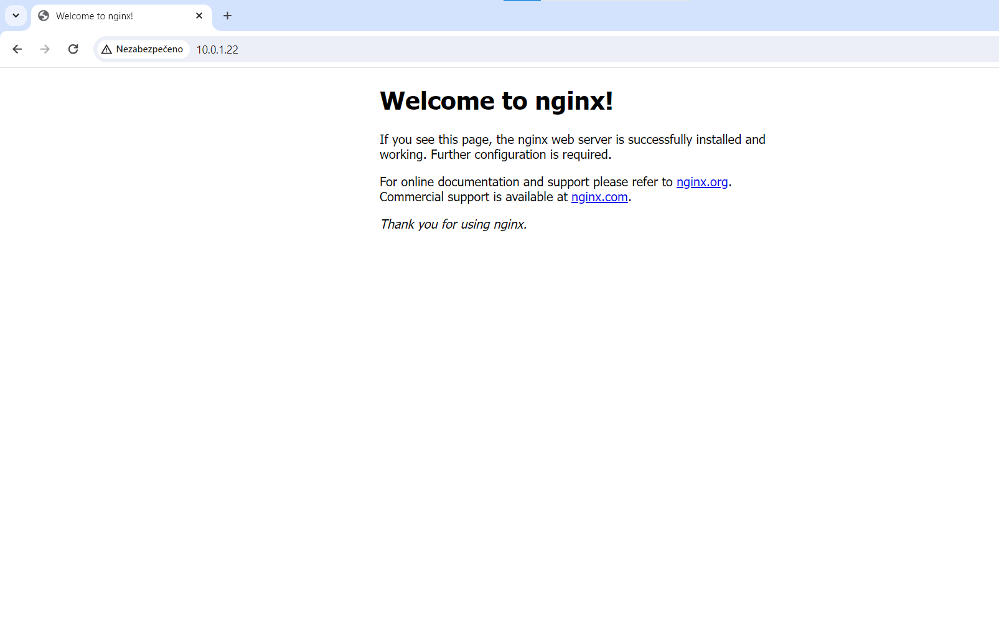

# Spuštění kontejneru s NGINX serverem
## Co je to NGINX server?
NGINX je softwarový webový server s otevřeným zdrojovým kódem. Představuje jedno z nejpopulárnějších řešení pro poskytnutí webového obsahu.
## Jak si nainstalovat kontejner s NGINX serverem?
Je potřeba mít na svém stroji již nainstalované virtualizační kontejnery. My jsme pracovali s kontejnerem Docker. Pokud nemáte nainstalovaný, tak návod naleznete [zde](../Návod%20na%20spuštění%20dockeru/README.md).
## Postup vytvoření kontejneru s NGINX:
### 1. Musíme si vytvořit kontejner s NGINX serverem. Vytvoří se následovně:
```linux
sudo docker run -itd --name my-website -p 80:80 nginx:latest bash
```
<br>
Tímhle příkazem vytvoříme kontejner s webovým serverem NGINX.
<br>

- **--name** = zde můžeme zvolit název kontejneru
- **-p** = zde volíme číslo portu, můžeme zvolit libovolné porty, jako například - 80:80, který se používá nejčastěji nebo 8080:80, 8081:80,...
<br>


<br>

### 2. Nyní potřebujeme kontejner spustit.
```linux
sudo docker start my-website
```
<br>


<br>
Spustíme námi vytvořený kontejner.

### 3. Potřebujeme vstoupit do kontejneru, abychom server spustili
Zde máme dva způsoby:
1. Vstup do kontejneru tímhle způsobem zajistí to, aby server zůstal spuštěný i přes odejití z kontejneru. **Doporučuji tenhle způsob.**
```linux
sudo docker exec -it my-website bash
``` 
<br>


<br>

2. Vstup do kontejneru tímhle způsobem zajistí to, aby server nezůstal spuštěný i po odchodu z kontejneru. Aby nám server fungoval, tak potřebujeme zůstat v kontejneru. Pokud si vyberete tenhle způsob, tak doporučiji prvně zjistit IP adresu Vašeho zařízení, pak již nebude moci odejít z kontejneru, jinak se webový server vypne. Krok číslo 6. Vám pomůže zjistit IP adresu.
```linux
sudo docker attach my-website
```

### 4. Potřebujeme spustit webový server NGINX
Pokud se právě nacházíte ve správném kontejneru, tak stačí zadat tenhle příkaz, který spustí webový server NGINX.
```linux
service nginx start
```
<br>


<br>


### 5. Jak odejít z kontejneru
Stačí Vám zadat do příkazové řádku tohle:
```linux
exit
```
<br>


<br>


### 6. Teď je potřeba jen zjistit IP adresu stroje
```linux
ip a
```
Ve výpisu uvidíte IP adresu vašeho stroje.
<br>


<br>

### 7. Zobrazení webové stránky v prohlížeči
Do vyhledávače stačí napsat: "http//vaše-ip:port-kontejneru-nginx". Měla by se Vám zobrazit úvodní stránka NGINX serveru.
<br>


<br>

## Úprava webového obsahu v kontejneru
Pokud chcete upravovat svůj obsah, tak musíte vytvořit nějaký kontejner s NGINX serverem, viz. výše. Pokud již kontejner máte vytvořený, tak postupujte následujícím způsobem.
### 1. Vstupte do kontejneru pokud tam již nejste
```linux
sudo docker exec -it my-website bash
```
<br>


<br>

nebo
```linux
sudo docker attach my-website
```
### 2. Přejděte do následujícíh složek, kde se vyskytují webové soubory
```linux
cd usr/share/nginx/html
```
<br>


<br>

Zde jsou všechny webové soubory. Hlavní stránka, která se Vám zobrazuje se jmenuje index.html.
### 3. Pokud chcete upravovat obsah v příkazovém řádku
Pokud chcete upravit obsah webové stránky přímo v příkazovém řádku, tak je potřeba si prvně nainstalovat nějakou knihovnu pro úpravu textových souborů. Jako je například nano, vi, vim.
```linux
apt update
apt install nano
y
```
<br>


<br>

### 4. Teď můžete přistupovat/upravovat soubory
```linux
nano index.html
```
<br>


<br>

#### Zdroje:
-	https://docs.docker.com/engine/install/debian/
-	GPT
