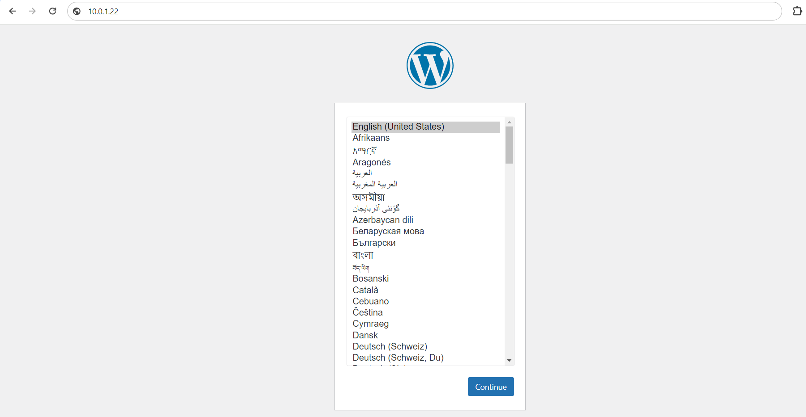

# Spuštění kontejneru s WordPressem
## Co je to WordPress?
WordPress je redakční systém pro tvoření webových stránek a správu jejich obsahu. Staví na otevřeném zdrojovém kódu. Nabízí spoustu šablon a doplňků.
<br>

## Jak si nainstalovat kontejner s WordPressem?
Je potřeba mít na svém stroji již nainstalované virtualizační kontejnery. My jsme pracovali s kontejnerem Docker. Pokud nemáte nainstalovaný, tak návod naleznete [zde](../README.md)

## Postup instalace:
### 1. Musíme si vytvořit kontejner s MySQL databází, který se vytvoří následovně:
```linux
docker run --name wordpressdb -e MYSQL_ROOT_PASSWORD=heslo -e MYSQL_DATABASE=wordpress -d mysql:5.7
```
- **MYSQL_ROOT_PASSWORD** = zadejte si heslo pro správce databáze
- **MYSQL_DATABASE** = zadejte si název databáze
- **mysql:5.7** = verze pro mysql
<br>


### 2. Musíme vytvořit kontejner s WordPressem.
```linux
docker run --name wordpress -p 80:80 -e WORDPRESS_DB_HOST=wordpressdb:3306 -e WORDPRESS_DB_USER=root -e WORDPRESS_DB_PASSWORD=vašeHeslo -e WORDPRESS_DB_NAME=wordpress --link wordpressdb:mysql -d wordpress
```

<br>
- **WORDPRESS_DB_HOST** = zde zadejte název pro databázi, kterou jste vytvořili v kroku jedna + musíte zadat port pro datábazi mysql (3306)
- **WORDPRESS_DB_USER** = zde zadáte jméno správce pro databázi, většinou je to root.
- **WORDPRESS_DB_PASSWORD** = Heslo k databázi / které jste zadali při vytváření kontejneru s databází
- **WORDPRESS_DB_NAME** = Jméno databáze
<br>

### 3. Teď je potřeba jen zjistit IP adresu stroje
```linux
ip a
```
Ve výpisu uvidíte IP adresu vašeho stroje.
<br>


### 4. Zobrazení WordPressu v prohlížeči
Do vyhledávače stačí napsat: "http//vaše-ip:port-kontejneru-wordpress". Měla by se Vám zobrazit instalační stránka WordPressu. 
<br>



<br>

Pokud se Vám instalační stránka nezobrazila, tak se někde musela stát chyba. Možné chyby:
1. Zkontrolujte zda jste zadali správný port kontejneru, pokud jste postupovali podle tohohle návodu, tak port je 80
2. Zkontrolujte zda jste zadali správnou IP adresu do prohlížeče.
<br>

Pokud jste postupovali přesně podle návodu a nemáte chybu v kontejneru docker, tak by mělo všechno řádně fungovat.
